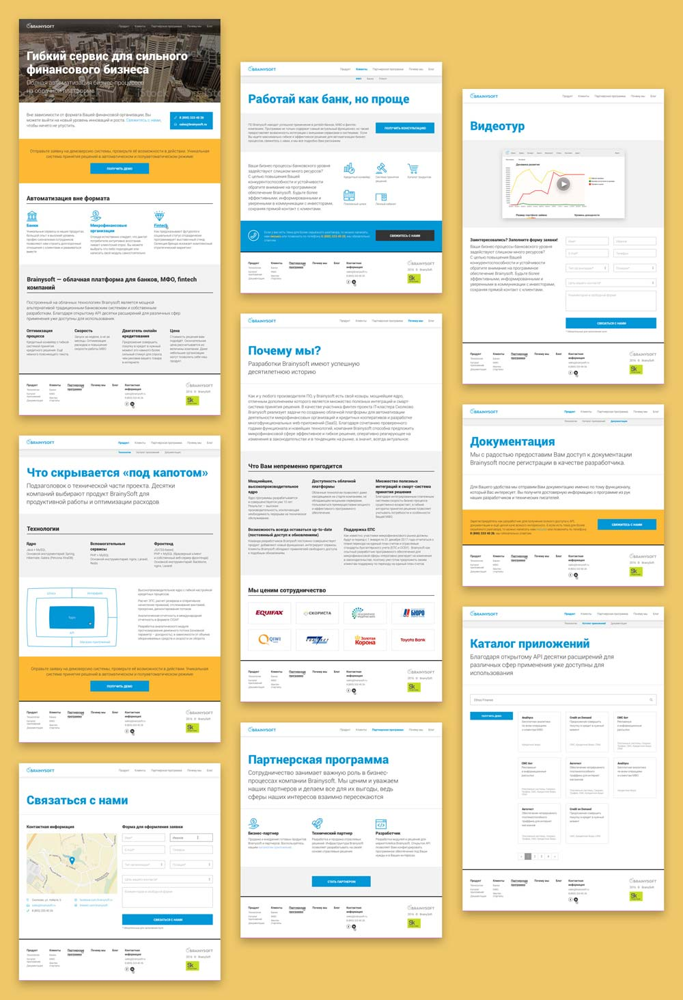
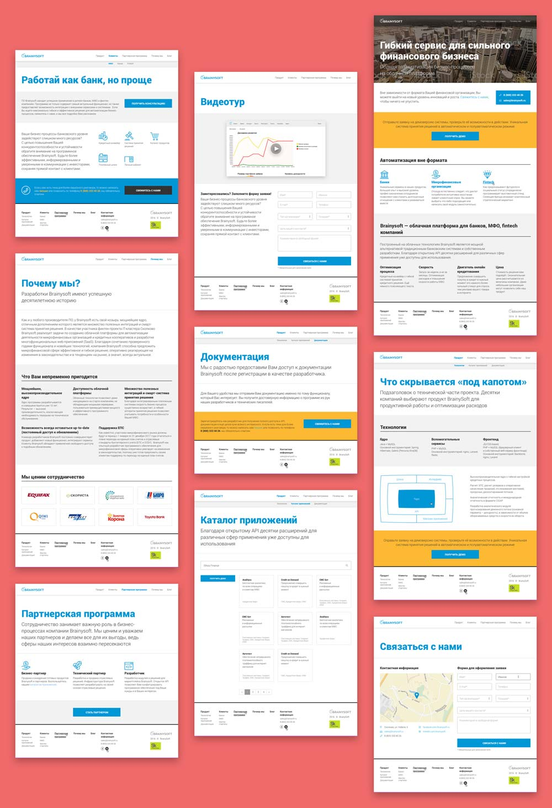
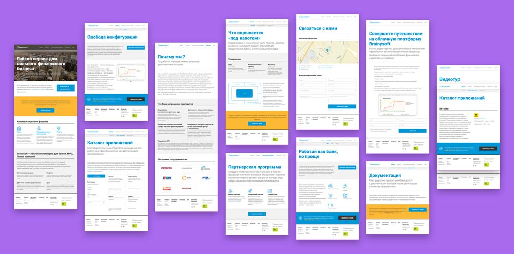
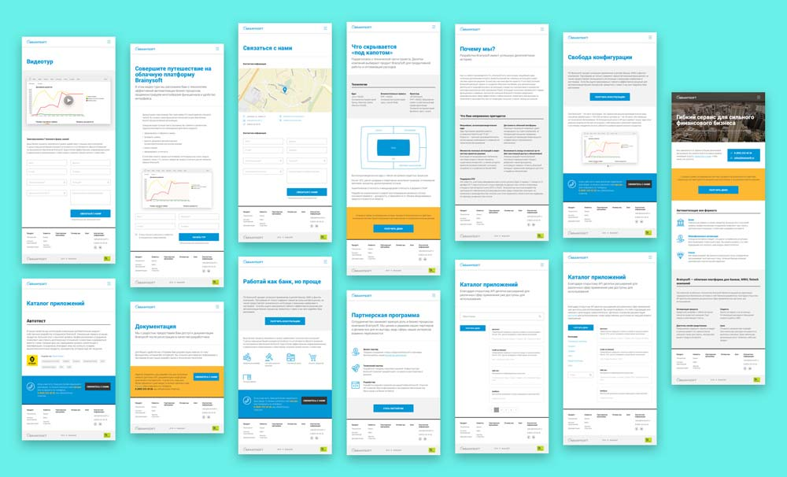
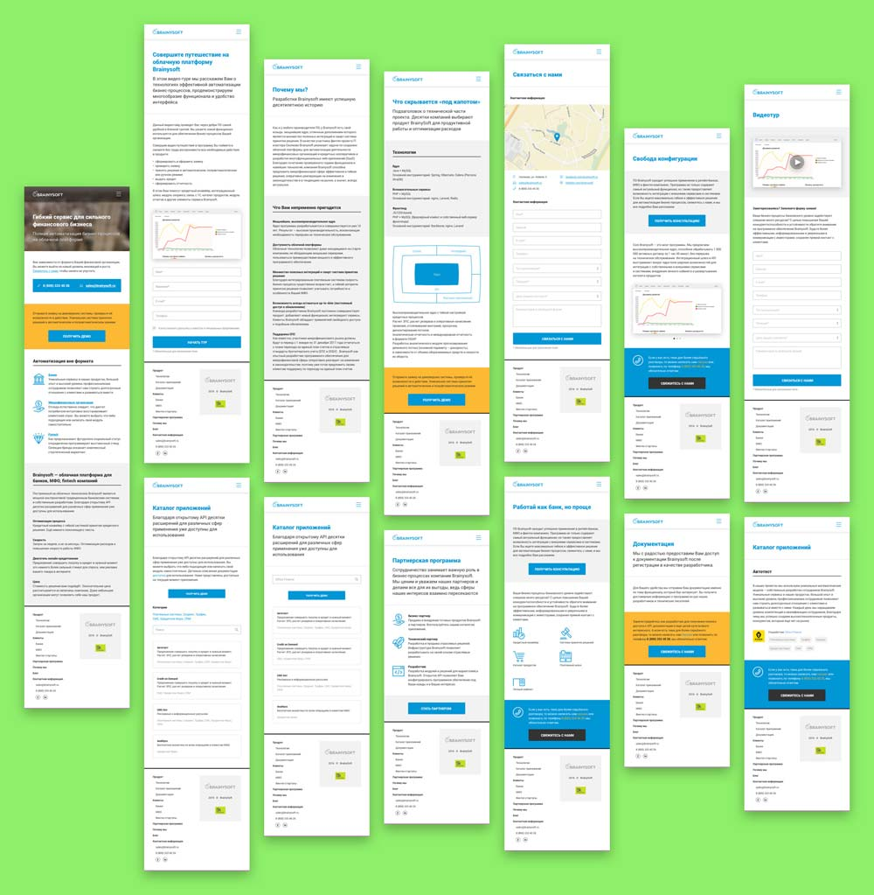

The website for fintech startup, who succeeded and became a full product. The first time it was a simple landing page, but after a short period, it became not enough. Since the product is B2B website decoration is plain and well structured. Small illustrations are placed if there’s a need to empathize some particular information. 

